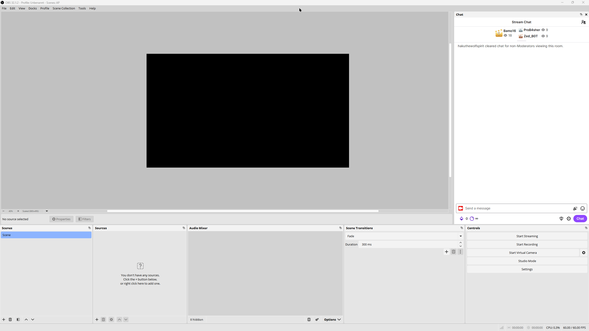

# HakuStream.Kit




Building blocks for a Twitch stream bot, plus ready-to-use modules built on them.

- **HakuStream.Kit** — the framework: Twitch chat + EventSub connection, OAuth device flow with token storage in Windows Credential Manager, attribute-based chat commands and channel-point redeems, an event bus, an OBS WebSocket client, and tiny atomic JSON persistence.
- **HakuStream.Archipelago** — POV switching for [Archipelago](https://archipelago.gg/) multiworld races: viewers spend channel points to choose which runner's POV the stream shows.
- **HakuStream.Shoutouts** — `!so`, `!raid`, and `!watchclip` for moderators: shouting out a streamer plays one of their clips live in OBS, and raids play a send-off clip before the raid fires.
- **samples/Archipelago.Host**, **samples/Shoutout.Host** — ready-to-run bot exes hosting one module each. If you just want a bot, these are what you run.

Windows only (credential storage and the audio/OBS tooling assume it).

## I just want the exe

1. Download the zip of the bot you want (`ArchipelagoBot` or `ShoutoutBot`) from the Releases page and unzip it anywhere.
2. Copy `appsettings.example.json` to `appsettings.json` (same folder as the exe) and fill it in:
   - **Twitch**: create an app at [dev.twitch.tv/console](https://dev.twitch.tv/console/apps) (category: Chat Bot, OAuth redirect URL: `http://localhost:3000/callback`, client type: confidential). Put its Client ID and Client Secret in the config, plus your Twitch username and channel.
   - **Obs**: in OBS, Tools → WebSocket Server Settings → enable, copy the password. Default port is 4455.
   - The module's own section (**Archipelago** or **Shoutout**): see its OBS scene setup below.
3. Run the exe. On first start a browser window opens to authorize the bot with Twitch; the token is stored in Windows Credential Manager (run the exe with the `twitchreauth` argument to clear it).

Each exe is a standalone bot, so running more than one means an `appsettings.json` next to each — the Twitch and Obs sections are simply copied. A combined host may come later.

## Archipelago

### OBS scene setup

`!ap setup <name1> [name2] …` (broadcaster only) is the whole session setup in one command: the number of names decides the POV count (you plus 1–7 named runners, eight POVs max). Missing scenes are created, the runner names are written into the text sources, and the POV rewards are created/enabled. Scenes that already exist are left untouched, so re-running — with different names or more runners — is safe and only fills the gaps. The scenes:

- Per runner, a shared scene (`AP_SHARED_Me`, `AP_SHARED_P2`, …) on a 1920x1080 canvas: a color background in the runner's color, a window capture (`AP_P2_WINDOW`) and a browser source (`AP_P2_BROWSER`) inset 18px so the background shows as a colored frame, and a name text source (`AP_P2_NAME`) in the upper left. Both capture sources start hidden so they don't get in the way — unhide whichever matches how that runner delivers their feed (see below). Your own scene instead gets a visible window capture and an `AP_Me_AUDIO` application audio capture, no browser source.
- Per runner, a broadcast scene (`AP_POV_Me`, `AP_POV_P2`, …) that nests the shared scenes: the featured runner at 1440x810 in the top left, the others as 480x270 thumbnails — three below the primary, then up to four in the right column.
- One `AP_DISCORD` scene nested into every broadcast scene, holding a `Discord Overlay` browser source and a `Discord Audio` application audio capture, so Discord follows the stream across POV switches. (obs-websocket cannot create source groups, so a nested scene stands in for the folder.)

These names are the defaults the module works with out of the box. If you prefer your own scene/source names, build the scenes yourself and mirror the names in the `Archipelago` section of `appsettings.json` (`OwnScene`, `OwnSharedScene`, `OwnNameSource`, `OwnAudioSource`, and a `Slots` array with `PovScene`/`SharedScene`/`NameSource`/`BrowserSource`/`Color` per runner — a configured `Slots` array replaces all seven defaults). Each slot's `Color` is both the frame color and the reward button color.

### Getting the runner feeds in

#### Your own POV

Your game runs locally, so no Discord or vdo.ninja is involved for yourself:

- `AP_Me_WINDOW` — pick your game window in its properties. If a fullscreen-exclusive game won't show up in a window capture, replace it with a Game Capture source by hand; the layout doesn't care what the source is, only that it sits in the shared scene.
- `AP_Me_AUDIO` — an application audio capture; select your game in it once per session. The bot mutes and unmutes it automatically depending on the featured POV (see audio routing below). Don't be tempted to use a plain desktop audio device instead — that would also pick up Discord and double the `Discord Audio` capture.
- Your mic is the normal global mic input in OBS settings, independent of these scenes. There's no echo risk from the Discord capture: Discord never plays your own voice back, so the application audio capture only carries the other runners.

For the other runners, unhide either the window capture or the browser source in their shared scene, per runner:

#### Discord screenshare (window capture)

Everyone joins a voice channel and streams their game (Go Live). For each runner, pop their stream out into its own window (hover the stream, click the pop-out icon), unhide their `AP_Pn_WINDOW` source, and set that window in it. Things to know:

- The pop-out windows must stay open for the capture to work. They can sit behind OBS, but don't minimize them — minimized windows stop rendering.
- OBS finds windows by title, and pop-out titles are per runner, so expect to re-pick the windows at the start of each session. Pop all streams out first, then go down the `AP_SHARED_*` scenes in one pass.
- If a capture stays black, set the source's capture method to "Windows 10 (1903 and up)" in its properties.
- Quality is whatever Discord gives that runner (720p30 without Nitro) — fine for thumbnails, visibly soft when featured at 1440x810.
- Game audio rides along with the runner's voice in the channel, so the `Discord Audio` capture picks up everything mixed together; there is no per-runner audio control. When such a POV is featured, the bot plays your own game audio alongside it (see audio routing below).

This is the lazy option: runners need nothing but Discord.

#### vdo.ninja (browser source)

[vdo.ninja](https://vdo.ninja/) sends each runner's screen to a browser source over WebRTC — noticeably better quality than Discord and no pop-out juggling, at the cost of a one-time link exchange. Agree on a stream ID per runner (anything unique, e.g. `mysession-p2`):

- The runner opens `https://vdo.ninja/?push=mysession-p2` in a browser, picks "Screenshare", selects their game window, and enables audio on the share.
- You put `https://vdo.ninja/?view=mysession-p2` as the URL of their `AP_P2_BROWSER` source and unhide it. The links are reusable, so a recurring group only does this once.
- The browser sources are created with "Control audio via OBS" enabled and muted: the bot unmutes only the featured runner's source on each POV switch, so the games don't all talk over each other while voice chat stays on Discord the whole time.
- WebRTC is peer-to-peer: each feed costs the runner some upload bandwidth, and feeds keep flowing only while the runner's push tab stays open.

#### Discord overlay and audio (`AP_DISCORD`)

The `AP_DISCORD` scene is nested into every broadcast scene, so both sources follow the stream wherever the POV switches:

- `Discord Audio` is an application audio capture: open its properties once and select Discord as the captured application. That puts the voice channel (and any Go Live audio) on stream. Don't also capture desktop audio, or you'll hear it twice.
- `Discord Overlay` is a browser source for the [Discord StreamKit overlay](https://streamkit.discord.com/overlay): choose "Install for OBS", pick the Voice Widget, select your server and voice channel, and copy the generated URL into the source. It shows who is in the channel and lights up whoever is speaking; style and position it however you like. It needs the Discord desktop app running to detect the channel.

### Running a session

- `!ap setup <name1> [name2] … [name7]` (broadcaster only) — creates any missing scenes, writes the runner names into the name text sources, and creates/enables one 1-point "POV: name" reward per runner, plus your own.
- Viewers redeem a POV reward → the program output switches to that runner's broadcast scene. The redemption is fulfilled on success and refunded if the scene switch fails.
- Every switch also routes the game audio: all runner browser sources are muted except the featured runner's, if their browser source is the one unhidden in their shared scene. If the featured POV captures a Discord pop-out instead (no per-runner audio available) — or is your own — your `AP_Me_AUDIO` game audio is unmuted in its place. Set `AlwaysShareOwnAudio: true` in the `Archipelago` config section to keep your own game audio on during every POV instead of only those.
- `!ap stop` — disables the POV rewards after the session. They are also disabled on bot shutdown.

Commands are deliberately silent in chat; outcomes are visible in OBS and the rewards list. Check `log.txt` next to the exe when something seems to not react.

Reward IDs are persisted in `data/archipelago.json` next to the exe and reused across setups (rewards are retitled rather than recreated). This keeps the bot clear of Twitch's 50-rewards-per-channel cap — don't delete that file casually.

## Shoutouts

`!so <user-or-clip-url>` (alias `!shoutout`, mods only) posts a chat announcement, fires Twitch's native `/shoutout` when possible (best effort — it has cooldowns and needs the target live), and plays a random recent clip of the target in OBS. `!raid <user>` plays a send-off clip first and only starts the raid once the clip has played, so you never raid into dead air. `!watchclip` replays the most recent clip link posted in chat. Besides the `!so` announcement the commands are silent in chat; outcomes are in `log.txt`.

### OBS scene setup

There is no setup command; create the scene and two sources by hand once:

- `SHARED_SHOUTOUT` — a scene; nest it into your main scenes wherever the clip should appear.
- `ShoutOutMedia` — a media source in that scene. The bot points it at the clip for playback and clears it afterwards.
- `ShoutOutBroadcaster` — a text source in that scene for the shouted-out streamer's name.

Leave both sources hidden; the bot unhides them for the clip's duration and hides them again. Different names go in the `Shoutout` section of `appsettings.json`. `ClipsWithinDays` bounds how recent the random clip should be (falls back to all-time when the window has none). `Message` is the `!so` chat announcement — `{name}` and `{url}` are replaced with the target's display name and channel link; set it to `""` to keep `!so` fully silent in chat.

### How clip playback works (and when it breaks)

OBS media sources need a direct video URL, which Twitch's official API does not provide. The signed `.mp4` URL therefore comes from Twitch's internal GraphQL endpoint — the same one the twitch.tv player (and tools like streamlink and TwitchDownloader) use, with the public web client id. It is undocumented and can change without notice. When it breaks, only clip playback dies: chat shoutouts keep working, raids are aborted rather than sent into dead air, and individual clips that fail to sign are skipped in favor of another candidate.

## Using the modules in your own bot

Reference `HakuStream.Kit` and the modules you want, then compose a host:

```csharp
var builder = Host.CreateApplicationBuilder(args);

builder.Services.AddTwitch(builder.Configuration);
builder.Services.AddArchipelago(builder.Configuration);

var host = builder.Build();

var auth = host.Services.GetRequiredService<TwitchAuthOrchestrator>();
if (!await auth.EnsureAuthenticatedAsync()) return;

await host.RunAsync();
```

`AddTwitch` registers the connection, auth, dispatchers, and registries once. Each module's `AddX` extension registers its settings, services, and its own commands/redeems — adding the module to the host is what activates it. See `samples/Archipelago.Host` for the complete picture, and `docs/adding-a-command.md` for writing commands.

## Building

```
dotnet build HakuStream.Kit.slnx
```

Requires the .NET 10 SDK on Windows.

## Conventions

- No code comments. Behavior that needs explaining is documented here or in `docs/`.
- Formatting is enforced with `dotnet format` against the repo's `.editorconfig`; CI rejects unformatted code. Run `dotnet format HakuStream.Kit.slnx` before committing.
